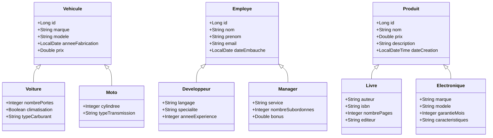

# 🗄️ Héritage JPA / Hibernate — Stratégies de Mapping

> A hands-on Java project demonstrating the three JPA/Hibernate inheritance mapping strategies through practical, real-world examples.

---

## 📽️ Demo

---

## 📖 About The Project

This project was built as a practical exercise to explore *JPA and Hibernate ORM inheritance* concepts through three independent real-world domains: vehicles, employees, and products.

It covers all three JPA inheritance strategies (`SINGLE_TABLE`, `JOINED`, `TABLE_PER_CLASS`), their trade-offs in terms of schema design, query performance, and constraint enforcement — all in a clean, minimal Maven project with an in-memory H2 database.

---

## 🗂️ Entity Model

| Strategy | Parent Class | Subclasses |
|---|---|---|
| `SINGLE_TABLE` | `Vehicule` | `Voiture`, `Moto` |
| `JOINED` | `Employe` | `Developpeur`, `Manager` |
| `TABLE_PER_CLASS` | `Produit` | `Livre`, `Electronique` |

### Entity Relationship Diagram



---

## 🔗 Inheritance Strategies Covered

### `SINGLE_TABLE` — Vehicule, Voiture, Moto
- All classes are stored in a **single table** (`vehicules`)
- A discriminator column (`type_vehicule`) identifies the concrete type: `"VOITURE"` or `"MOTO"`
- Subclass-specific columns are **nullable** for rows of other types
- Best for: shallow hierarchies with frequent polymorphic queries

### `JOINED` — Employe, Developpeur, Manager
- Each class has its **own table**; subclass tables share the parent's PK via a foreign key
- Polymorphic queries require **JOINs** across tables
- Fully normalized — subclass-specific columns can have `NOT NULL` constraints
- Best for: deep hierarchies where data integrity and normalization matter

### `TABLE_PER_CLASS` — Produit, Livre, Electronique
- Each **concrete class** gets its own complete, independent table
- No shared table — all inherited columns are duplicated in each subclass table
- Polymorphic queries use a **UNION** across tables
- Best for: hierarchies where subclasses are queried independently

---

## ✅ Test Scenarios (App.java)

The main method runs three automated demos:

**1. `testSingleTable`**
Creates `Voiture` and `Moto` instances, persists them, then runs polymorphic queries (`FROM Vehicule`) and subclass-specific queries to demonstrate the discriminator column in action.

**2. `testJoined`**
Creates `Developpeur` and `Manager` instances, persists them, then queries all employees polymorphically and individually — demonstrating the cross-table JOINs generated by Hibernate.

**3. `testTablePerClass`**
Creates `Livre` and `Electronique` instances, persists them, then runs polymorphic queries (using UNION) and independent subclass queries.

---

## 🛠️ Tech Stack

| Technology | Version |
|---|---|
| Java | 11+ |
| JPA | 2.2 |
| Hibernate | 5.x |
| H2 Database | In-memory (`mem:testdb`) |
| Bean Validation | `javax.validation` |
| Maven | 3.x |

---

## 🚀 Getting Started

### Prerequisites

- Java 11 or higher
- Maven 3.x


## 📁 Project Structure

```
src/
└── main/
    ├── java/
    │   └── com/example/
    │       ├── App.java                        ← Entry point & test scenarios
    │       └── model/
    │           ├── singletable/
    │           │   ├── Vehicule.java           ← @Inheritance(SINGLE_TABLE)
    │           │   ├── Voiture.java            ← @DiscriminatorValue("VOITURE")
    │           │   └── Moto.java               ← @DiscriminatorValue("MOTO")
    │           ├── joined/
    │           │   ├── Employe.java            ← @Inheritance(JOINED)
    │           │   ├── Developpeur.java        ← @Table("developpeurs")
    │           │   └── Manager.java            ← @Table("managers")
    │           └── tableperclass/
    │               ├── Produit.java            ← @Inheritance(TABLE_PER_CLASS)
    │               ├── Livre.java              ← @Table("livres")
    │               └── Electronique.java       ← @Table("electroniques")
    └── resources/
        └── META-INF/
            └── persistence.xml                 ← JPA / Hibernate config (H2)
```

---

## 💡 Key Concepts Demonstrated

- **Three inheritance strategies** and when to use each one
- **Discriminator columns** (`@DiscriminatorColumn`, `@DiscriminatorValue`) in `SINGLE_TABLE`
- **Foreign key joins** between parent and child tables in `JOINED`
- **UNION-based polymorphic queries** in `TABLE_PER_CLASS`
- **`GenerationType.AUTO` vs `IDENTITY`** — why `TABLE_PER_CLASS` requires `AUTO`
- **Bean Validation** annotations (`@NotBlank`, `@Email`, `@Positive`, `@Min`, `@Max`, `@PastOrPresent`)

---

## 📊 Strategy Comparison

| Feature | `SINGLE_TABLE` | `JOINED` | `TABLE_PER_CLASS` |
|---|---|---|---|
| Tables created | 1 | 1 per class | 1 per concrete class |
| Polymorphic query | Fast (no JOIN) | Slower (JOINs) | Slowest (UNION) |
| Nullable columns | Many | None | None |
| Normalization | Poor | Good | Moderate |
| `NOT NULL` on subclass fields | ❌ | ✅ | ✅ |

---
